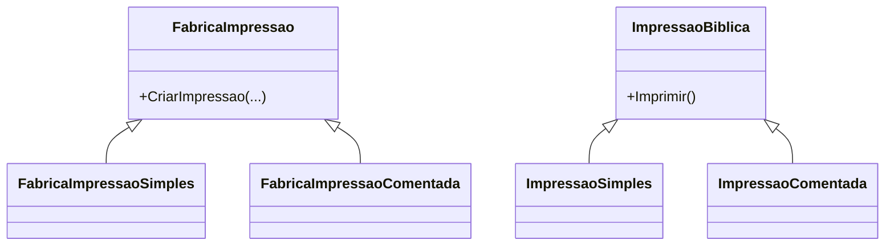

# Factory Method com Exemplo da Bíblia

Este exemplo demonstra o padrão de projeto **Factory Method** usando um contexto didático: diferentes tipos de impressão de versículos bíblicos.

## O que é Factory Method?
O Factory Method é um padrão criacional que define uma interface para criar um objeto, mas permite que as subclasses decidam qual classe instanciar. Ele separa a lógica de criação do uso do objeto.

---

## Estrutura do exemplo

- **ImpressaoBiblica.cs**: Classe abstrata base para impressões de versículos (produto).
- **ImpressaoSimples.cs**: Produto concreto para impressão simples.
- **ImpressaoComentada.cs**: Produto concreto para impressão com comentário.
- **FabricaImpressao.cs**: Classe abstrata base para fábricas de impressão.
- **FabricaImpressaoSimples.cs**: Fábrica concreta para impressão simples.
- **FabricaImpressaoComentada.cs**: Fábrica concreta para impressão comentada.
- **MinhaAppBiblia.cs**: Classe de teste (ponto de entrada) que demonstra o uso do padrão.

---

## Funcionamento

1. **Criação das fábricas**:
   - `FabricaImpressao fabricaSimples = new FabricaImpressaoSimples();`
   - `FabricaImpressao fabricaComentada = new FabricaImpressaoComentada();`
2. **Criação das impressões**:
   - Cada fábrica cria um tipo de impressão usando o método `CriarImpressao`.
3. **Impressão dos versículos**:
   - Cada impressão exibe seus detalhes, mostrando o tipo (simples ou comentada), livro, capítulo, versículo e texto.

---

## Como rodar este exemplo

1. Certifique-se de que todos os arquivos estão na pasta `FactoryMethod`.
2. Defina `MinhaAppBiblia` como ponto de entrada do projeto (ou rode diretamente se seu ambiente permitir):
   ```
   dotnet run --project FactoryMethod/MinhaAppBiblia.cs
   ```
   ou ajuste o ponto de entrada principal para chamar `MinhaAppBiblia.Main()`.
3. **Saída esperada:**
   ```
   João 3:16 - "Porque Deus amou o mundo de tal maneira..."

   Salmos 23:1 - "O Senhor é o meu pastor; nada me faltará."
   Comentário: Este versículo fala sobre confiança em Deus.
   ```

---

## O que você aprende com esse exemplo?
- Como o Factory Method separa a lógica de criação do objeto do seu uso.
- Como adicionar novos tipos de impressão (produtos) sem alterar o código cliente.
- Como aplicar o padrão em um contexto real e didático.

---

## Diagrama simplificado



---

## Referências
- Livro: *Design Patterns: Elements of Reusable Object-Oriented Software* (GoF)
- Exemplo didático criado para facilitar o entendimento do padrão Factory Method