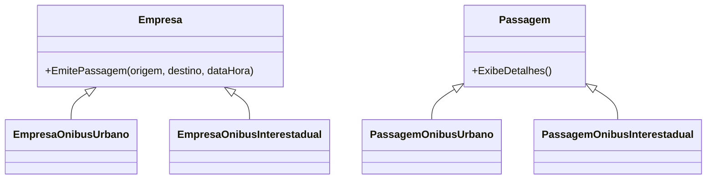

# Factory Method (GoF) em C#

Este exemplo demonstra o padrão de projeto **Factory Method** conforme descrito pela Gang of Four (GoF), adaptado de um exemplo Java para C#.

## O que é Factory Method?
O Factory Method é um padrão criacional que define uma interface para criar um objeto, mas permite que as subclasses decidam qual classe instanciar. Ele permite adiar a instanciação para subclasses.

---

## Estrutura do exemplo

- **Passagem.cs**: Classe abstrata base para passagens de ônibus (produto).
- **PassagemOnibusUrbano.cs**: Produto concreto para passagens urbanas.
- **PassagemOnibusInterestadual.cs**: Produto concreto para passagens interestaduais.
- **Empresa.cs**: Classe abstrata base para empresas de ônibus (fábrica).
- **EmpresaOnibusUrbano.cs**: Fábrica concreta que emite passagens urbanas.
- **EmpresaOnibusInterestadual.cs**: Fábrica concreta que emite passagens interestaduais.
- **MinhaApp.cs**: Classe de teste (ponto de entrada) que demonstra o uso do padrão.

---

## Funcionamento

1. **Criação das fábricas**:
   - `Empresa viacaoABCLocal = new EmpresaOnibusUrbano();`
   - `Empresa viacaoXYZInter = new EmpresaOnibusInterestadual();`
2. **Emissão das passagens**:
   - Cada fábrica emite um tipo de passagem usando o método `EmitePassagem`.
3. **Exibição dos detalhes**:
   - Cada passagem exibe seus detalhes, mostrando o tipo (urbana ou interestadual), origem, destino e data/hora.

---

## Como rodar este exemplo

1. Certifique-se de que o projeto está compilado.
2. Para rodar apenas este exemplo, defina `MinhaApp` como ponto de entrada. Você pode:
   - Executar diretamente pelo terminal:
     ```
     dotnet run --project FactoryMethod/MinhaApp.cs
     ```
   - Ou, temporariamente, mover o conteúdo de `Main` para o ponto de entrada principal do projeto.
3. **Saída esperada:**
   ```
   Passagem de ônibus urbana: São Paulo para Campinas, Data/Hora: 10/03/2016 11:00
   Passagem de ônibus interestadual: São Paulo para Rio de Janeiro, Data/Hora: 20/04/2016 08:30
   ```

---

## Diagrama simplificado



---

## Referências
- Livro: *Design Patterns: Elements of Reusable Object-Oriented Software* (GoF)
- Exemplo original em Java adaptado para C#
