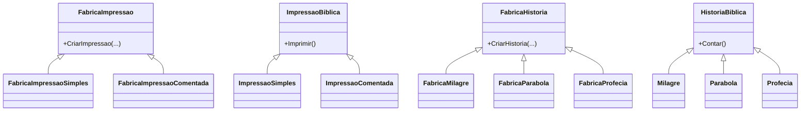

# Factory Method com Exemplo da Bíblia

## Versículo relacionado ao Factory Method (muitos membros, diferentes funções)
> “Porque assim como o corpo é um e tem muitos membros, e todos os membros, sendo muitos, constituem um só corpo, assim também com respeito a Cristo.”  
> — 1 Coríntios 12:12

**Explicação:** O Factory Method mostra que, a partir de uma mesma “fábrica” (corpo), podem surgir diferentes “produtos” (membros), cada um com sua função.

Este exemplo demonstra o padrão de projeto **Factory Method** usando dois contextos didáticos: diferentes tipos de impressão de versículos bíblicos e diferentes tipos de histórias bíblicas.

## O que é Factory Method?
O Factory Method é um padrão criacional que define uma interface para criar um objeto, mas permite que as subclasses decidam qual classe instanciar. Ele separa a lógica de criação do uso do objeto.

---

## Exemplo 1: Impressão de Versículos

### Versículo relacionado à impressão de versículos
> “Ora, há diversidade de dons, mas o Espírito é o mesmo.”  
> — 1 Coríntios 12:4

**Explicação:** A mesma Palavra pode ser apresentada de formas diferentes, mas a origem (o Espírito) é a mesma.

- **ImpressaoBiblica.cs**: Classe abstrata base para impressões de versículos (produto).
- **ImpressaoSimples.cs**: Produto concreto para impressão simples.
- **ImpressaoComentada.cs**: Produto concreto para impressão com comentário.
- **FabricaImpressao.cs**: Classe abstrata base para fábricas de impressão.
- **FabricaImpressaoSimples.cs**: Fábrica concreta para impressão simples.
- **FabricaImpressaoComentada.cs**: Fábrica concreta para impressão comentada.
- **MinhaAppBiblia.cs**: Classe de teste (ponto de entrada) que demonstra o uso do padrão.

### Funcionamento
1. Criação das fábricas:
   - `FabricaImpressao fabricaSimples = new FabricaImpressaoSimples();`
   - `FabricaImpressao fabricaComentada = new FabricaImpressaoComentada();`
2. Criação das impressões:
   - Cada fábrica cria um tipo de impressão usando o método `CriarImpressao`.
3. Impressão dos versículos:
   - Cada impressão exibe seus detalhes, mostrando o tipo (simples ou comentada), livro, capítulo, versículo e texto.

### Como rodar
- Defina `MinhaAppBiblia` como ponto de entrada do projeto ou chame `MinhaAppBiblia.Executar()` no `Program.cs`.
- Saída esperada:
  ```
  João 3:16 - "Porque Deus amou o mundo de tal maneira..."

  Salmos 23:1 - "O Senhor é o meu pastor; nada me faltará."
  Comentário: Este versículo fala sobre confiança em Deus.
  ```

---

## Exemplo 2: Histórias da Bíblia (Milagre, Parábola, Profecia)

### Versículo relacionado às histórias bíblicas
> “Porque assim como o corpo é um e tem muitos membros, e todos os membros, sendo muitos, constituem um só corpo, assim também com respeito a Cristo.”  
> — 1 Coríntios 12:12

**Explicação:** O Factory Method mostra que, a partir de uma mesma “fábrica” (corpo), podem surgir diferentes “produtos” (membros), cada um com sua função.

- **HistoriaBiblica.cs**: Classe abstrata base para histórias bíblicas (produto).
- **Milagre.cs**: Produto concreto para história de milagre.
- **Parabola.cs**: Produto concreto para história de parábola.
- **Profecia.cs**: Produto concreto para história de profecia.
- **FabricaHistoria.cs**: Classe abstrata base para fábricas de histórias.
- **FabricaMilagre.cs**: Fábrica concreta para histórias de milagre.
- **FabricaParabola.cs**: Fábrica concreta para histórias de parábola.
- **FabricaProfecia.cs**: Fábrica concreta para histórias de profecia.
- **MinhaAppHistorias.cs**: Classe de teste que demonstra o uso do padrão.

### Funcionamento
1. Criação das fábricas:
   - `FabricaHistoria fabricaMilagre = new FabricaMilagre();`
   - `FabricaHistoria fabricaParabola = new FabricaParabola();`
   - `FabricaHistoria fabricaProfecia = new FabricaProfecia();`
2. Criação das histórias:
   - Cada fábrica cria um tipo de história usando o método `CriarHistoria`.
3. Contar as histórias:
   - Cada história exibe seus detalhes, mostrando o tipo (milagre, parábola, profecia), título, referência e resumo.

### Como rodar
- Defina `MinhaAppHistorias` como ponto de entrada do projeto ou chame `MinhaAppHistorias.Executar()` no `Program.cs`.
- Saída esperada:
  ```
  [Milagre] Jesus anda sobre as águas (Mateus 14:22-33)
  Jesus caminha sobre o mar para encontrar os discípulos durante uma tempestade.

  [Parábola] O Bom Samaritano (Lucas 10:25-37)
  Jesus conta a parábola de um homem que ajuda outro, mostrando o que é amar o próximo.

  [Profecia] Profecia do Messias (Isaías 53)
  Isaías profetiza sobre o sofrimento e redenção do Messias.
  ```

---

## O que você aprende com esses exemplos?
- Como o Factory Method separa a lógica de criação do objeto do seu uso.
- Como adicionar novos tipos de produtos sem alterar o código cliente.
- Como aplicar o padrão em contextos reais e didáticos.

---

## Diagrama simplificado



---

## Referências
- Livro: *Design Patterns: Elements of Reusable Object-Oriented Software* (GoF)
- Exemplos didáticos criados para facilitar o entendimento do padrão Factory Method