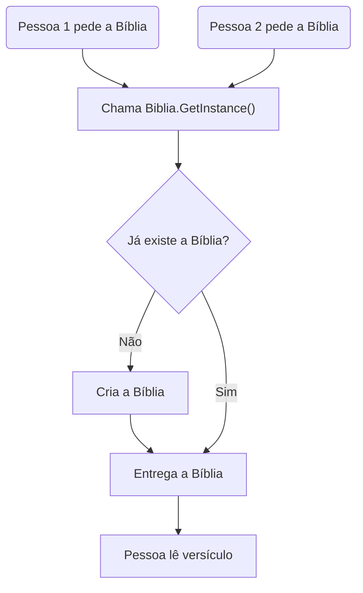

# Padrão Singleton em C#

Este diretório contém exemplos práticos do padrão de projeto **Singleton** usando C#.

## O que é Singleton?
O padrão Singleton garante que uma classe tenha **apenas uma instância** e fornece um ponto global de acesso a ela. É útil quando você precisa de um único objeto compartilhado em todo o sistema, como uma janela principal, um gerenciador de configuração, ou uma fonte de dados única.

---

## Exemplos neste projeto

### 1. Singleton da Janela (Windows Forms)
- **Arquivo:** `Janela.cs`
- **Descrição:** Garante que só exista uma janela principal do tipo `Form` durante toda a execução do programa.
- **Como funciona:**
  - O construtor é privado.
  - Um campo estático guarda a instância única.
  - O método `GetInstance()` retorna sempre a mesma janela.

### 2. Singleton da Bíblia
- **Arquivo:** `Biblia.cs`
- **Descrição:** Simula uma única Bíblia oficial acessível por todo o sistema, usando o padrão Singleton.
- **Como funciona:**
  - O construtor é privado.
  - Um campo estático guarda a instância única.
  - O método `GetInstance()` retorna sempre a mesma Bíblia.
  - O método `LerVersiculo` simula a leitura de um versículo.

---

## Como testar

1. **Execute o projeto:**
   ```
   dotnet run
   ```
2. **Saída esperada no console:**
   - "Bíblia criada!" (apenas uma vez)
   - "Lendo João 3:16"
   - "Lendo Salmos 23:1"
   - "biblia1 e biblia2 são a mesma instância? True"
   - (Em seguida, a janela principal do programa será exibida)

---

## Analogia com a Bíblia
Imagine que em uma igreja só pode haver **uma única Bíblia oficial** no púlpito. Todos que quiserem ler, consultar ou citar um versículo, vão até essa mesma Bíblia. Assim funciona o Singleton: todos acessam a mesma instância, nunca é criada outra.

---

## Fluxo do Singleton



---

## Como funciona o Singleton (resumo)
- Construtor privado impede criação externa.
- Campo estático armazena a instância única.
- Método estático retorna sempre a mesma instância.

---

## Arquivos principais
- `Janela.cs` — Exemplo de Singleton com Windows Forms
- `Biblia.cs` — Exemplo didático de Singleton com analogia bíblica
- `Singleton.cs` — Contém o método `Main` e outro exemplo de Singleton

---

## Autor
Documentação gerada com auxílio de IA para fins didáticos.
